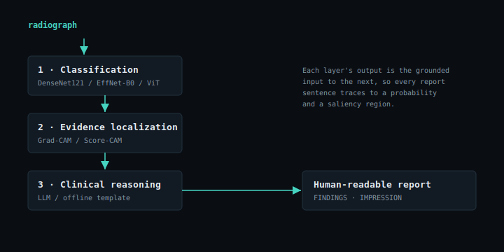
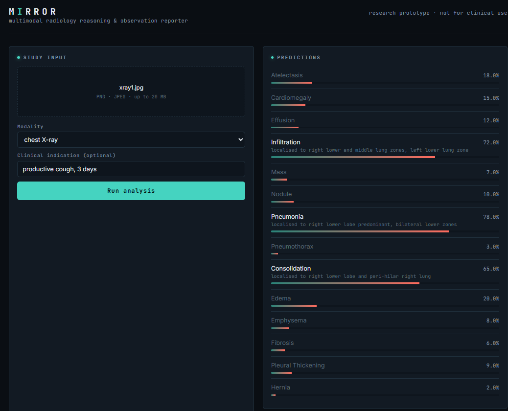
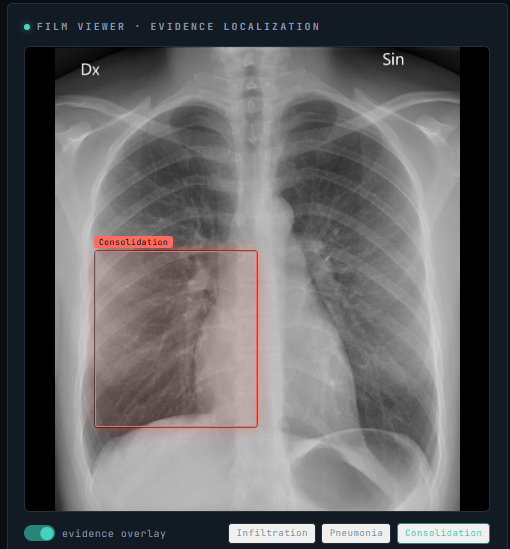
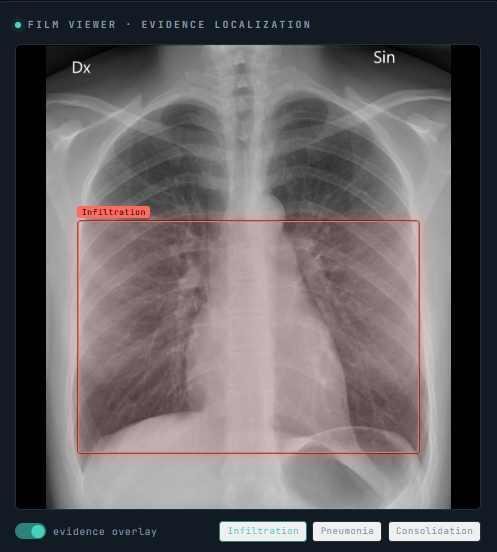
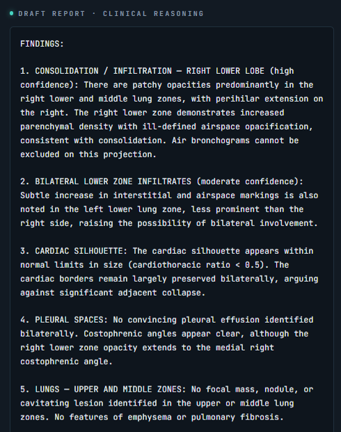
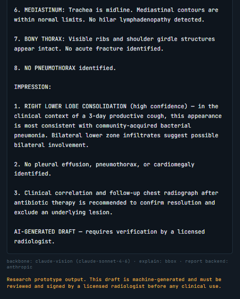

<div align="center">

# MIRROR

**Multimodal Intelligent Radiology Reasoning and Observation Reporter**

*An explainable medical-AI system that reads radiological images, localizes its
own evidence, and writes a clinician-style draft report. Completed as part of the
**Global Indian Scientists & Technocrats (GIST) 2026 Summer Internship Program.***

Mentored by **Mr. Sriram Venkatapathy** (AI Research at Capital One, PhD-CS at IIT Hyderabad)

**Live Demo:** https://mirror-ten-jet.vercel.app/

</div>

---

## Tech Stack

<!--- ML / AI --->
<p align="center"><sub><b>AI / ML & Frameworks:</b></sub></p>
<p align="center">
  
  
  
  
  
  
  
  
  
</p>

<!--- Backend --->
<p align="center"><sub><b>Backend:</b></sub></p>
<p align="center">
  
  
  
  
</p>

<!--- Frontend --->
<p align="center"><sub><b>Frontend:</b></sub></p>
<p align="center">
  
  
  
  
  
</p>

<!--- Data / Tooling --->
<p align="center"><sub><b>Data & Tooling:</b></sub></p>
<p align="center">
  
  
  
  
  
</p>

<!--- Paper / Writing --->
<p align="center"><sub><b>Paper & Writing:</b></sub></p>
<p align="center">
  
  
  
  
</p>

## What MIRROR does

Most medical-imaging models stop at a prediction. MIRROR adds the two layers that
make a prediction *trustworthy and usable*: it shows **where** the evidence is and
explains **what it means** in plain clinical language.

It analyzes a radiograph (chest X-ray today; CT and brain MRI are scaffolded),
identifies potential abnormalities, highlights the diagnostic evidence with
saliency overlays, and generates a structured natural-language report.

```
Image → Prediction → Evidence Localization → Clinical Reasoning → Human-Readable Report
```

## Research question

> Can multimodal AI systems that combine image classification, visual
> explainability, and language generation improve interpretability and user trust
> in medical image analysis compared to classification-only approaches?

The repo is built to *measure* this: predictive metrics (AUROC/F1) and
explanation metrics (pointing game / localization IoU) live side by side in
`evaluation/`.

## Why it's different (novelty)

While most medical-imaging systems focus solely on disease classification, MIRROR
integrates three complementary layers into one framework:

1. **Radiological image understanding**: a CNN/ViT classifier.
2. **Visual evidence localization**: Grad-CAM / Score-CAM saliency.
3. **Natural-language clinical report generation**: an LLM (or offline template)
   that reasons *only* over the structured evidence above.

The result not only predicts abnormalities but communicates **why** the
prediction was made and **how** it relates to potential clinical findings, and
every sentence in the report traces back to a probability and a saliency region.

## System architecture

MIRROR turns a single radiograph into a reviewable diagnostic draft by chaining
**three complementary layers**, where each layer's output becomes the *grounded
input* to the next, so the final report can always be traced back to a
probability and a specific image region.



| Layer | Module | Does | Produces |
| --- | --- | --- | --- |
| **1 · Classification** | [`models/classification/`](models/classification/) | A CNN/ViT backbone (DenseNet121 · EfficientNet-B0 · ViT-B/16) with a 14-way multi-label head | Per-label probabilities |
| **2 · Evidence localization** | [`models/explainability/`](models/explainability/) | Grad-CAM / Score-CAM hooks the target layer for each positive label | Heatmap + region (centroid, bbox) |
| **3 · Clinical reasoning** | [`models/report_generation/`](models/report_generation/) | An LLM (or an offline template) prompts over the **structured evidence only, never the pixels** | `FINDINGS` / `IMPRESSION` report |

[`models/pipeline.py`](models/pipeline.py) orchestrates the four stages into one
`AnalysisResult`. The two later layers are individually toggleable, which is
exactly what recovers the ablation conditions the research question names
(classification-only → +localization → full MIRROR) and lets the evaluation
harnesses show *added interpretability at no predictive cost*.

**Two interchangeable serving engines satisfy the same response contract**, so
the UI is identical in both:

- **Local full stack:** FastAPI ([`backend/`](backend/)) wraps the real PyTorch
  pipeline; the frontend points at it via `NEXT_PUBLIC_API_URL`. Every input type
  (PNG/JPEG/BMP/WEBP + DICOM) and rendered Grad-CAM overlays.
- **Hosted on Vercel:** a Next.js serverless route
  ([`frontend/app/api/analyze/route.ts`](frontend/app/api/analyze/route.ts)) uses
  **Claude's vision model** as a drop-in engine (the PyTorch pipeline can't fit
  serverless), returning the same JSON with a bounding box per finding.

For the full write-up (per-layer module breakdowns, the grounding rationale, and
the deployment topology table), see [`docs/architecture.md`](docs/architecture.md).

## Live demo (v1.1.0)

The hosted build at **[mirror-ten-jet.vercel.app](https://mirror-ten-jet.vercel.app/)**
runs the full pipeline in the browser via a Next.js serverless route backed by
Claude vision (`claude-haiku-4-5`). Below is one real session: a chest X-ray
uploaded with the indication *"productive cough, 3 days."*

**1. Upload and per-label predictions.** All 14 ChestX-ray14 labels are scored;
Pneumonia (78%), Infiltration (72%), and Consolidation (65%) rise above
threshold, each with a saliency-derived location.



**2. Evidence localization.** Each positive finding gets a bounding box on the
film, toggled by the chips. Consolidation localizes to the right lower lobe;
Infiltration spans the bilateral lower zones.

| Consolidation | Infiltration |
| :---: | :---: |
|  |  |

**3. Draft clinical report.** A structured `FINDINGS` / `IMPRESSION` report,
grounded in the evidence above, with pertinent negatives and the AI-generated
disclaimer.

| FINDINGS | IMPRESSION |
| :---: | :---: |
|  |  |

A full walkthrough of these outputs and how the v1.1.0 deployment works is in
[`docs/deployment-showcase.md`](docs/deployment-showcase.md).

## Quickstart

Two ways to run MIRROR: **locally** (the real PyTorch pipeline, every input type)
or as a **live website** (deploy to Vercel, powered by Claude vision).
Both are below.

### A. Run locally: every step, from a fresh Git Bash window

These are the *complete* instructions starting from nothing. They assume
**Windows + [Git Bash](https://git-scm.com/downloads)** (the commands are the
same on macOS/Linux). Run them top to bottom.

**0. One-time prerequisites** (skip any you already have):

- **Git**: <https://git-scm.com/downloads> (this is what gives you Git Bash).
- **Python 3.10+**: <https://www.python.org/downloads/> (tick *"Add Python to
  PATH"* in the installer).
- **Node.js 18+**: <https://nodejs.org/> (only needed for the web UI in step 6).

Verify they're visible inside Git Bash:

```bash
git --version && python --version && node --version
```

**1. Clone the repository and enter it:**

```bash
git clone https://github.com/vignesh-nagarajan-vn/MIRROR.git
cd MIRROR
```

**2. Create and activate a virtual environment:**

```bash
python -m venv .venv
source .venv/Scripts/activate     # macOS/Linux: source .venv/bin/activate
```

Your prompt should now be prefixed with `(.venv)`.

**3. Install the Python dependencies:**

```bash
pip install -r requirements.txt
```

**4. Run the full pipeline on one image** (no checkpoint or API key needed; a
synthetic sample ships with the repo, so this works with zero downloads):

```bash
python -m demo.run_demo datasets/samples/chestxray14/images/synth_0001.png
# Native DICOM works too; point it at the bundled .dcm:
python -m demo.run_demo datasets/samples/chestxray14/images/synth_0000.dcm
```

That prints predictions and a draft report, and writes Grad-CAM overlays to
`demo/assets/`. It runs on ImageNet-pretrained weights with the offline template
report backend, so it works anywhere. Inputs may be **PNG/JPEG/BMP/WEBP or DICOM
(`.dcm`)**. DICOM is decoded with the modality/VOI LUT and MONOCHROME1 handling
applied (see [`datasets/README.md`](datasets/README.md#dicom-ingest)).

**5. Start the backend API** (leave it running in this terminal):

```bash
cd backend
uvicorn app.main:app --reload --port 8000     # Swagger UI at http://localhost:8000/docs
```

**6. Start the frontend** (open a *new* Git Bash window, then):

```bash
cd MIRROR/frontend
npm install
cp .env.local.example .env.local              # points the UI at the local backend
npm run dev                                    # http://localhost:3000
```

**7. Use it.** Open <http://localhost:3000>, drop in a radiograph, toggle the
evidence overlay, and read the draft report. Stop either server with `Ctrl+C`;
reactivate the venv later with `source .venv/Scripts/activate`. Full reference in
[`docs/setup.md`](docs/setup.md).

> **Optional: richer reports with Claude.** The offline template backend needs
> nothing. To generate prose reports with Claude, `export ANTHROPIC_API_KEY=sk-ant-...`
> and set `report.provider: anthropic` in [`configs/default.yaml`](configs/default.yaml).
> It falls back to the template automatically if the key is missing.

### B. Deploy a live public website (Vercel)

A live deployment of this repo is already running at
**[mirror-ten-jet.vercel.app](https://mirror-ten-jet.vercel.app/)** (see the
[deployment showcase](#live-demo-v110) above). To stand up your own:

Want a shareable URL instead of localhost? Deploy the app to Vercel in about two
minutes. The hosted site is **fully functional on its own** (no backend to host)
because a Next.js serverless route uses **Claude's vision model** as the
inference engine, since the PyTorch pipeline can't run on serverless. You only
need a free Vercel account and an Anthropic API key.

Import the repo from the Vercel dashboard (**[vercel.com/new](https://vercel.com/new)
→ Import Git Repository → pick your `MIRROR` repo**). When the configure screen
appears:

1. **Root Directory**: set to **`frontend`** (the Next.js app lives there).
2. **Environment Variables**: set `ANTHROPIC_API_KEY` to your key from
   <https://console.anthropic.com/>. (Optional: `ANTHROPIC_MODEL`, default
   `claude-haiku-4-5`.)
3. Click **Deploy** to get a public `*.vercel.app` URL.

Step-by-step instructions (including the Vercel CLI path) are in
[`docs/deployment.md`](docs/deployment.md). Deploying without a key still works:
the analyze route returns a clearly-labelled demo result so the site never
hard-fails.

## Repository layout

```
mirror/
├── frontend/                     # Next.js "reading-room" UI
│   ├── app/
│   │   ├── page.tsx              # the single-page reading room
│   │   ├── layout.tsx           # root layout + fonts
│   │   └── api/analyze/route.ts  # serverless analyze route (Vercel, Claude vision)
│   ├── components/               # UploadPanel · FilmViewer · FindingsList · ReportPanel
│   ├── lib/api.ts                # typed client + response contract
│   ├── styles/globals.css        # reading-room theme
│   ├── vercel.json               # Vercel build/function config
│   └── .env.local.example        # NEXT_PUBLIC_API_URL + ANTHROPIC_API_KEY
├── backend/                      # FastAPI service (lazy-loads the pipeline)
│   └── app/
│       ├── api/routes.py        # /api/analyze · /api/health · /api/labels
│       ├── core/config.py       # settings (upload limits, version)
│       ├── services/            # pipeline_service (singleton, lazy load)
│       ├── schemas/             # Pydantic request/response models
│       └── main.py              # app factory + CORS
├── models/                       # the three layers + orchestration
│   ├── classification/          # DenseNet121 / EfficientNet / ViT: model, dataset, train, infer
│   ├── explainability/          # Grad-CAM, Score-CAM, explainer, overlay rendering
│   ├── report_generation/       # LLM (Claude) + offline-template generator, prompts
│   ├── common/                  # constants, config, preprocessing (DICOM ingest)
│   └── pipeline.py              # Image → Prediction → Evidence → Report
├── evaluation/                   # AUROC/F1, localization IoU, ablation, multi-seed
│   ├── evaluate.py              # predictive quality + bootstrap CIs
│   ├── evaluate_localization.py # pointing game / IoU vs. NIH boxes
│   ├── ablation.py              # classification-only vs. +localization vs. full
│   ├── aggregate_seeds.py       # mean ± std across training seeds
│   └── metrics.py · repro.py    # metric defs + reproducibility stamping
├── results/                      # committed example outputs (see results/README.md)
│   ├── output_sheets/           # per-image prediction CSV + structured findings JSON
│   └── evaluation/              # eval / localization / ablation / aggregate snapshots
├── datasets/                     # dataset docs + prep scripts (+ tiny synthetic sample set)
│   └── samples/chestxray14/     # 24 synthetic studies (NIH layout, one DICOM), committed
├── notebooks/                    # data exploration + pipeline walkthrough
├── tests/                        # torch-free unit tests (metrics, ablation, repro, …)
├── docs/                         # architecture · setup · deployment · API reference
│   └── images/architecture.svg  # the system diagram
├── paper/                        # LaTeX draft (main.tex, references.bib, tables/) + build notes
├── demo/                         # CLI demo (run_demo.py) + generated assets/
├── configs/default.yaml          # single source of tunables (backbone, CAM, report backend)
├── docker-compose.yml            # backend :8000 + frontend :3000
├── Makefile · requirements.txt
└── README.md
```

## Datasets

**Primary:** NIH **ChestX-ray14**: 112,120 chest X-rays, 14 disease categories;
ideal for initial development and benchmarking.

**Secondary:** RSNA Pneumonia Detection Challenge, MIMIC-CXR (images + reports),
Brain Tumor MRI Dataset, COVID-19 Radiography Database.

None are redistributed here. A tiny **synthetic** stand-in ships under
`datasets/samples/chestxray14/` (NIH layout, one DICOM included) so the demo,
loader, and a training smoke test run with zero downloads. See
[`datasets/README.md`](datasets/README.md) for the expected layout, the NIH
downloader (`download_chestxray14.py`), licensing notes, and prep scripts.

## Configuration

Everything tunable lives in [`configs/default.yaml`](configs/default.yaml): swap
the backbone, switch Grad-CAM ↔ Score-CAM, or change the report backend without
touching code:

```yaml
model:   { backbone: densenet121 }      # or efficientnet_b0 / vit_b_16
explain: { method: gradcam }            # or scorecam
report:  { provider: template }         # or anthropic (needs ANTHROPIC_API_KEY)
```

## Train & evaluate

```bash
# Train (requires ChestX-ray14 locally)
python -m models.classification.train --config configs/default.yaml

# Evaluate prediction quality (AUROC/F1 with bootstrap 95% CIs) → evaluation/results/
python -m evaluation.evaluate --config configs/default.yaml \
    --checkpoint models/checkpoints/densenet121_best.pt

# Evaluate explanation quality (pointing game / localization IoU) against the
# NIH ground-truth boxes (BBox_List_2017.csv) → JSON in evaluation/results/
python -m evaluation.evaluate_localization --config configs/default.yaml \
    --checkpoint models/checkpoints/densenet121_best.pt

# Ablation: classification-only baseline vs. +localization vs. full MIRROR.
# Folds the JSON above into one comparison table + a latency profile.
python -m evaluation.ablation --config configs/default.yaml \
    --prediction-results evaluation/results/eval_densenet121.json \
    --localization-results evaluation/results/loc_densenet121_gradcam.json

# Robustness across training seeds: train with --seed {0,1,2}, evaluate each,
# then aggregate to mean ± std → evaluation/results/aggregate_<backbone>.json
python -m evaluation.aggregate_seeds evaluation/results/eval_seed*.json
```

The harnesses answer the project's two questions side by side: `evaluate.py`
measures *what* the model predicts (per-label and macro AUROC, macro F1), and
`evaluate_localization.py` measures *whether the evidence it highlights is in the
right place*, scoring each Grad-CAM/Score-CAM map against the ~984 hand-drawn
boxes that NIH ships for 8 of the 14 pathologies (pointing-game accuracy, mean
IoU, and localization accuracy at an IoU threshold). `ablation.py` then builds the
**baseline comparison the research question names**: classification-only vs.
+localization vs. full MIRROR, in one table. Because layers 2-3 are post-hoc, the
AUROC/F1 column is identical across rows (verified empirically), so the table
shows added interpretability *at no predictive cost*, alongside the per-layer
latency. Every predictive number carries a **bootstrap 95% CI** (test-set
sampling noise) and can be summarised across training seeds with
`aggregate_seeds.py` as **mean ± std** (training noise); each results JSON also
stamps a `reproducibility` block (seed, git commit, library versions) so the
numbers regenerate. See
[`datasets/README.md`](datasets/README.md#localization-ground-truth) for the box
file and [`evaluation/README.md`](evaluation/README.md) for the metric details.

`evaluation/results/` is git-ignored; a committed, curated snapshot of every
harness's output, plus per-image **output sheets** for the synthetic sample set,
lives in [`results/`](results/) so the numbers' *format* is visible in the repo
(clearly marked illustrative, not benchmark claims).

## Potential contributions

- An end-to-end multimodal radiology analysis pipeline.
- An explainable-AI framework for medical imaging (Grad-CAM / Score-CAM).
- Automated clinician-style report generation grounded in model evidence.
- An evaluation of interpretability versus predictive performance.
- An open-source benchmark for combining computer vision with LLM-based reasoning
  in healthcare.

## Paper

**Goal:** a short (5 to 8 page) paper for a medical-imaging workshop that doubles
as an arXiv preprint and GIST 2026 internship report. It answers MIRROR's
research question with evidence: *does adding evidence localization and grounded
report generation to a chest-radiograph classifier improve interpretability
without a predictive penalty?* The headline result is the ablation, framing the
contribution as **interpretability at no predictive cost**.

A partial **LaTeX** draft lives in [`paper/`](paper/): [`main.tex`](paper/main.tex),
[`references.bib`](paper/references.bib) (20 sources, including a one-page
literature review), and placeholder result tables under
[`paper/tables/`](paper/tables/) wired via `\input` to the evaluation harness
output, so the tables populate once a checkpoint is trained. The
results-independent sections (introduction, literature review, architecture,
experimental setup, ethics and limitations) are written; everything blocked on a
trained model is a `\pending{}` stub (search the source for `PENDING`). Build it
in **Overleaf** or with a local TeX install:

```bash
cd paper
pdflatex main && bibtex main && pdflatex main && pdflatex main
```

See [`paper/README.md`](paper/README.md) for the section map and how the tables
are generated.

## Documentation

- [`docs/architecture.md`](docs/architecture.md): how the layers connect + the
  local/Vercel deployment topology.
- [`docs/setup.md`](docs/setup.md): installation and running locally.
- [`docs/deployment.md`](docs/deployment.md): deploy a live public site on Vercel.
- [`docs/deployment-showcase.md`](docs/deployment-showcase.md): how the v1.1.0
  live deployment works, with an analyzed sample session.
- [`docs/api.md`](docs/api.md): REST endpoints and payloads.
- [`results/README.md`](results/README.md): committed example outputs and metric
  snapshots.
- [`paper/README.md`](paper/README.md): the workshop/preprint draft, its section
  map, and how result tables are generated.
- [`CONTRIBUTING.md`](CONTRIBUTING.md): development guidelines.

## Safety, ethics, and limitations

- **Not for clinical use.** Outputs are drafts for research into explainability
  and trust; they require clinician verification.
- **No PHI in version control.** Raw images, weights, and results are git-ignored.
- **Grounded by design.** The language layer never sees pixels, only structured
  evidence, so it cannot invent findings the classifier didn't produce.
- **Honest about uncertainty.** Predictions are probabilities; below-threshold
  findings are reported as pertinent negatives, not silently dropped.

## License

MIT. See [`LICENSE`](LICENSE), including the research-use medical disclaimer.
